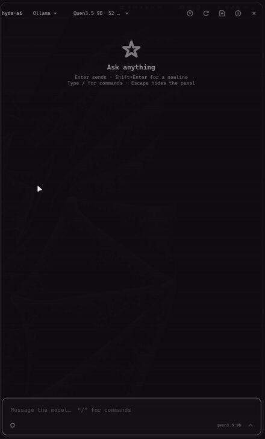
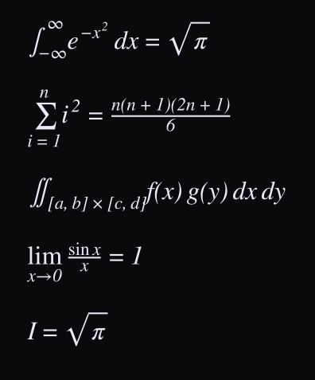

<div align="center">

# hyde-ai

**Chat com LLM numa barra lateral do Hyprland.**

GTK4 + layer-shell, com as cores do wallbash do
[HyDE](https://github.com/HyDE-Project/HyDE).

Claude · Gemini · ChatGPT · Ollama local — todos com streaming.

</div>

> [!WARNING]
> **Projeto em beta. Uso não recomendado.**
>
> Escrito para um setup específico e ainda instável: a interface tem arestas,
> a API muda sem aviso e há caminhos não testados. Se for experimentar, espere
> quebrar — e não conte com ele para nada importante.

---

<div align="center">
  
  <p><em>Uma pergunta de cálculo respondida pelo Qwen3.5 9B rodando local.
  Acelerado 2&times;.</em></p>
</div>

---

## Matemática tipografada

Fórmulas passam pelo `mathtext` do matplotlib, um parser TeX completo, e saem
em **SVG rasterizado na densidade real da tela** — nítidas em qualquer escala.

<div align="center">
  
  <p><em>Stacked fractions, integrals with limits, radicands under the bar.
  STIX &mdash; the font used in scientific publishing.</em></p>
</div>

Equações longas são quebradas nos sinais de relação, como o ambiente `align`
do LaTeX — sem isso viravam uma faixa larga com rolagem horizontal.

Clicar numa fórmula copia o LaTeX; clique duplo revela o código como texto
selecionável.

---

## Instalação

### 1. Pré-requisitos

Arch Linux com Hyprland e [HyDE](https://github.com/HyDE-Project/HyDE).

### 2. Clonar e instalar

```bash
git clone https://github.com/reanlucas/hyde-ai.git
cd hyde-ai
./install.sh
```

O instalador resolve as dependências, copia os arquivos, gera as cores do tema
e roda um diagnóstico ao final. É idempotente.

### 3. Configurar os provedores

```bash
hyde-ai --setup
```

Pede as chaves de API e o modelo padrão. A configuração é gravada em
`~/.config/hyde-ai/config.json` com permissão `0600`.

**O Ollama não precisa de chave.** Se você já tem o serviço rodando, os modelos
aparecem sozinhos:

```bash
sudo pacman -S ollama-rocm      # AMD; use "ollama" para CPU/NVIDIA
sudo systemctl enable --now ollama
ollama pull qwen3.5:9b
```

### 4. Abrir

```bash
hyde-ai --toggle
```

### 5. Atalho e autostart (opcional)

Em `~/.config/hypr/hyprland.lua`:

```lua
hl.bind("SUPER + I", hl.dsp.exec_cmd("$HOME/.local/bin/hyde-ai --toggle"), {
    description = "[Launcher|Apps] AI sidebar",
})

hl.on("hyprland.start", function()
    hl.exec_cmd("$HOME/.local/bin/hyde-ai --daemon")
end)
```

---

## Uso

`Enter` envia · `Shift+Enter` quebra linha · `Esc` fecha

Digite **`/`** no campo para abrir a paleta de comandos, que filtra conforme
você escreve.

| Comando | O que faz |
|---|---|
| `/clear` | conversa nova |
| `/historico` | lista as conversas salvas |
| `/provider` `/model` | troca de provedor ou modelo |
| `/key <provedor> <valor>` | guarda uma chave de API |
| `/velocidade` | tokens/s médio por modelo |
| `/refresh` | reprocura provedores e modelos |
| `/side left\|right` · `/width 35` | geometria do painel |

Da linha de comando, `hyde-ai --ask "sua pergunta"` abre o painel e envia a
pergunta direto — dá para pendurar num atalho ou chamar de um script.

---

## Velocidade

Duas medidas, deliberadamente distintas:

- **Ao lado do modelo** — média histórica das últimas 60 execuções: *como ele
  vem rodando*
- **No cabeçalho de cada resposta** — tempo até o primeiro token, tempo de
  geração e a velocidade **daquela** resposta

```
qwen3.5:9b  ·  0.8s pensando  ·  14.7s  ·  61 tok/s
```

O tempo é separado em dois de propósito: *pensando* é da submissão ao primeiro
token (carregamento, prompt eval). A velocidade é calculada só sobre a geração
— incluir a espera falsearia o número para baixo.

As métricas ficam gravadas junto da mensagem, então acompanham a conversa.

---

## Modelos de raciocínio

Qwen3, o-series e Claude com *thinking* geram um rascunho antes da resposta.

**Desligado por padrão** — o rascunho multiplica o tempo de resposta por cinco
ou mais, e quase nunca compensa numa barra lateral. O botão ao lado do envio
liga por pergunta; `/think` aceita `auto`, `on`, `off`, `low`, `medium` e
`high`.

Com ele ligado, o cabeçalho pulsa **Pensando…** enquanto o modelo trabalha e
vira **Pensou por 36s** quando termina — clicável, com o rascunho inteiro
dentro.

Sem isso a bolha ficaria vazia durante todo o raciocínio, e vazia para sempre
se o rascunho consumisse todo o `max_tokens`. Quando isso acontece, o painel
diz o que houve em vez de deixar a mensagem em branco.

---

## Histórico

Conversas salvas e agrupadas por provedor, com título, data e contagem de
mensagens. O botão no cabeçalho lista e restaura; guarda 40 conversas.

---

## Renderização

Markdown por [markdown-it-py](https://github.com/executablebooks/markdown-it-py)
— o mesmo motor (porte Python) usado pelos frontends web: tabelas com
alinhamento, listas, ênfase, código com realce via GtkSourceView.

Matemática detectada em quatro formatos, porque os modelos alternam entre eles:
`$$...$$`, `\[...\]`, ` ```math ` e parágrafos que são só LaTeX.

O `$` de shell não é confundido com matemática: `$HOME`, `$1`, `${VAR}` e `$5`
ficam como texto. Durante o streaming, uma fórmula ainda pela metade fica
escondida até o delimitador fechar — ela aparece inteira, de uma vez.

### Testes

```bash
python3 tests/test_bateria.py     # 43 casos: matemática, Python, JS, shell
python3 tests/test_parser.py      # 21 casos: regressões e streaming
```

Cada caso veio de uma resposta que apareceu errada na tela.

---

## Decisões de projeto

<details>
<summary><b>GTK4 nativo, não KaTeX no WebKit</b></summary>

O painel transmite token a token, e cada delta significaria re-renderizar um
documento HTML — pisca e custa caro num fluxo ao vivo. Widgets GTK atualizam de
forma incremental.

O custo dessa escolha é que a fórmula é imagem e não tem texto selecionável,
daí o clique-para-copiar.

</details>

<details>
<summary><b>Atualização incremental durante o streaming</b></summary>

Reconstruir a árvore de widgets a cada token fazia a mensagem sumir e
reaparecer. Preservando o prefixo de segmentos já fechados, nenhum widget
estável é destruído: **0 reconstruções** numa resposta com fórmula e tabela,
contra uma por token.

</details>

<details>
<summary><b>Disponibilidade do provedor vem do cache</b></summary>

Consultar `available()` no envio disparava uma sondagem de rede **síncrona na
thread da interface**, segurando a mensagem do usuário por até 2 segundos.

</details>

<details>
<summary><b>Delimitadores normalizados antes do parser</b></summary>

O markdown trata `\[` como escape e come a barra, o que fazia a fórmula
desaparecer no meio do parágrafo. A normalização roda antes, protegendo o que
estiver dentro de crase.

</details>

---

## Dependências

`gtk4-layer-shell` `python-gobject` `libadwaita` `gtksourceview5`
`python-matplotlib` `librsvg` `python-markdown-it` `python-mdit_py_plugins`
`python-pylatexenc` — todas nos repositórios oficiais do Arch.

---

## Licença

MIT
