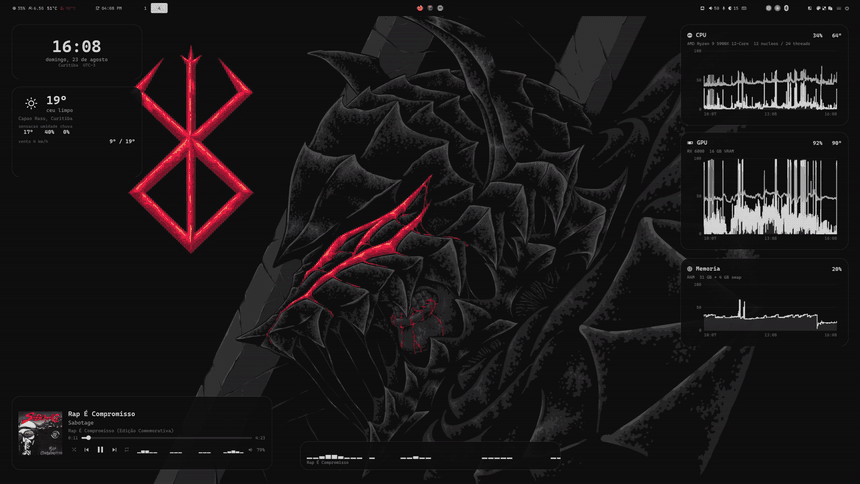
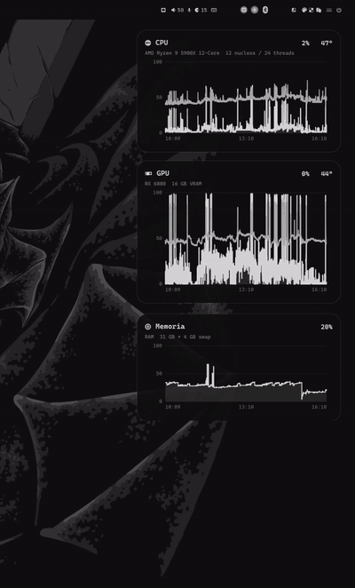
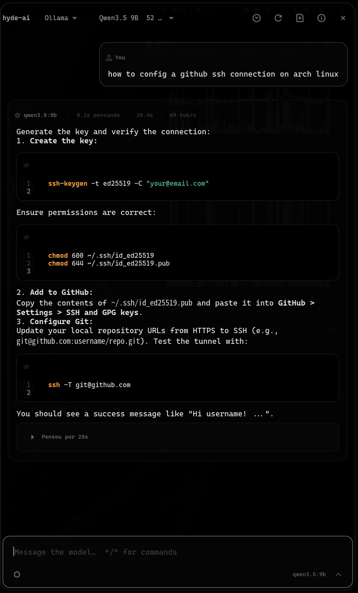

<div align="center">

# hyde-ai

**An agentic AI sidebar for Hyprland.**

GTK4 with layer-shell, coloured by
[HyDE](https://github.com/HyDE-Project/HyDE)'s wallbash.

The frontend is this panel; the backend is 100%
[Hypr-IA](https://github.com/NousResearch/hermes-agent) (a local base forked from Nous Research's hermes-agent) — its models,
its 90+ tools, its agent loop, its memory and sessions — running as a
separate process and streaming over JSON-RPC.

</div>

> [!WARNING]
> **Beta. Not recommended for use.**
>
> Written for one specific setup and still unstable: the interface has rough
> edges, the API changes without notice and there are untested paths. If you
> try it, expect breakage — and don't rely on it for anything that matters.
>
> **Every turn is agentic**: Hypr-IA can read files, run commands and use the
> web to answer. Anything that changes the system asks for your permission
> inline, but the permission gate is Hypr-IA's — review what you approve.

---

<div align="center">
  
  <p><em>A real sidebar: layer-shell, sliding over the desktop without resizing
  anything. <code>/side left</code> moves it to the other edge.</em></p>
</div>

<div align="center">
  
  &nbsp;&nbsp;
  
  <p><em>A practical question, answered by Qwen3.5 9B running locally.
  Syntax-highlighted, line-numbered code blocks. Sped up 3.5&times;.</em></p>
</div>

<div align="center">
  
  <p><em>And a calculus one, with the formulas typeset as they arrive.</em></p>
</div>

---

## Typeset mathematics

Formulas go through matplotlib's `mathtext`, a complete TeX parser, and come
out as **SVG rasterised at the screen's real density** — sharp at any scale.

<div align="center">
  
  <p><em>Stacked fractions, integrals with limits, radicands under the bar.
  STIX &mdash; the font used in scientific publishing.</em></p>
</div>

Long equations are broken at the relation signs, like LaTeX's `align`
environment — without that they turned into a wide strip with a horizontal
scrollbar.

Clicking a formula copies the LaTeX; double-clicking reveals the source as
selectable text.

---

## Installation

### 1. Prerequisites

Arch Linux with Hyprland and [HyDE](https://github.com/HyDE-Project/HyDE).

### 2. Clone and install

```bash
git clone https://github.com/reanlucas/hyde-ai.git
cd hyde-ai
./install.sh
```

The installer resolves the dependencies, copies the files, renders the theme
colours and runs a diagnostic at the end. It is idempotent.

### 3. Point it at Hypr-IA

The installer clones the upstream base when the
[hypr-ia](https://github.com/NousResearch/hermes-agent) checkout is absent
(default `~/Projetos/hypr-ia`, override with `HYDE_AI_HYPRIA_DIR`) and builds
its venv with [uv](https://github.com/astral-sh/uv) — the system
Python cannot run Hypr-IA (it needs `>=3.11,<3.14`), so uv fetches a managed
3.11 into `hypr-ia/.venv`.

Installation is strict by default: a missing backend, venv, theme stylesheet,
plugin or failed diagnostic makes it exit non-zero. Set `HYDE_AI_STRICT=0`
only to preserve the old best-effort behavior while diagnosing an installation.

```bash
hyde-ai --setup      # repairs/confirms the venv path and pings the real gateway
hyde-ai --doctor     # full report, including a live gateway check
```

API keys and the default model belong to Hypr-IA now: set keys from the panel
with `/key <provider> <value>` (they land in `~/.hypr-ia/.env`) and the model
with `/model`, or edit `~/.hypr-ia/config.yaml`.

**Local models via Ollama** work through Hypr-IA's Ollama provider:

```yaml
# ~/.hypr-ia/config.yaml
model:
  default: "qwen3.5:9b"
  provider: "ollama"
  base_url: "http://localhost:11434/v1"
  api_key: "ollama"
```

### 4. Open it

```bash
hyde-ai --toggle
```

### 5. Keybind and autostart (optional)

In `~/.config/hypr/hyprland.lua`:

```lua
hl.bind("SUPER + I", hl.dsp.exec_cmd("$HOME/.local/bin/hyde-ai --toggle"), {
    description = "[Launcher|Apps] AI sidebar",
})

hl.on("hyprland.start", function()
    hl.exec_cmd("$HOME/.local/bin/hyde-ai --daemon")
end)
```

---

## Using it

`Enter` sends · `Shift+Enter` newline · `Esc` closes

Type **`/`** in the input to open the command palette, which filters as you
write.

| Command | What it does |
|---|---|
| `/clear` | new conversation (a fresh Hypr-IA session) |
| `/historico` | conversations saved in Hypr-IA · `/historico abrir <n\|id>` resumes one |
| `/provider` `/model` | switch provider or model (Hypr-IA inventory) |
| `/key <provider> <value>` | store an API key in Hypr-IA (`~/.hypr-ia/.env`) |
| `/speed` | average tokens/s per model |
| `/refresh` | re-probe the Hypr-IA inventory |
| `/think on\|off\|low\|medium\|high` | show the reasoning draft / effort |
| `/side left\|right` · `/width 35` | panel geometry |

Any other `/command` is forwarded to Hypr-IA itself — `/memoria`, `/skills`
and the rest of its catalogue autocomplete in the palette, tagged `hypria`.

From the shell, `hyde-ai --ask "your question"` opens the panel and sends the
question straight through — handy on a keybind or from a script.

---

## Speed

Two measurements, deliberately distinct:

- **Next to the model** — a rolling average of the last 60 runs: *how it has
  been performing*
- **In each reply's header** — time to first token, generation time and the
  speed of **that** reply

```
qwen3.5:9b  ·  0.8s thinking  ·  14.7s  ·  61 tok/s
```

The time is split on purpose: *thinking* covers submission to first token
(loading, prompt eval). The speed is computed over generation alone —
including the wait would drag the number down for the wrong reason.

The metrics are stored with the message, so they travel with the conversation.

---

## Reasoning models

Models with *thinking* produce a draft before the answer. The sun button
next to send shows or hides that draft in the conversation; the effort
selector beside it (or `/think none…ultra`) changes the reasoning effort of
the **current** session, live. A terminal button toggles **agent mode**: on,
Hypr-IA uses its tools (files, commands, web, memory); off, the turn is a
plain conversation — `/agente on|off` does the same.

With the draft visible, the header pulses **Pensando…** while the model works
and becomes **Pensou por 36s** when it finishes — clickable, with the whole
draft inside.

---

## The agent is Hypr-IA

Every turn goes through [Hypr-IA](https://github.com/NousResearch/hermes-agent) (base: hermes-agent)'s own loop: terminal,
files, web search, browser, memory, skills, subagents — 90+ tools, executed
server-side in its process. The panel renders what happens as it happens:

```
You: why did the metrics collector stop?

  ▸ terminal   systemctl --user status hyde-widgets-collector      ok
  ▸ terminal   journalctl --user -u hyde-widgets-collector -n 30   ok

The GPU path moved from card1 to card2 after the last boot,
so the collector can no longer find the sensor.
```

When Hypr-IA wants to run something its own safety layer classifies as
dangerous, the panel shows an approval card with the exact command and the
choices Hypr-IA offers — **Permitir**, **Sempre nesta sessão**, **Sempre**,
**Negar**:

```
  ⚠ aprovacao   sed -i 's/card1/card2/' collector
                [ Negar ] [ Sempre ] [ Sempre nesta sessão ] [ Permitir ]
```

The agent stays parked until you click. A refusal is not a dead end — Hypr-IA
receives it and explains or proposes another way. Mid-turn questions from the
agent (clarify) appear the same way, with an inline answer field. `sudo` and
secret prompts are auto-denied — the sidebar has no password UI, on purpose.

The protocol layer has its own test harness, no GTK required:

```bash
python3 tests/test_hypria_client.py   # transport: 18 cases against a fake gateway
python3 tests/test_registry.py        # adapter: 21 cases, full event table
```

---

## History

`/clear` starts a fresh Hypr-IA session; the transcript of every conversation
lives in Hypr-IA's SQLite (`~/.hypr-ia/state.db`). `/historico` lists them and
`/historico abrir <n>` resumes one — the next message continues that session,
with Hypr-IA's full context. The header button keeps the local display cache
(40 conversations) for instant restore.

---

## Rendering

Markdown via [markdown-it-py](https://github.com/executablebooks/markdown-it-py)
— the same engine (Python port) the web frontends use: aligned tables, lists,
emphasis, code highlighted through GtkSourceView.

Mathematics is detected in four shapes, because models alternate between them:
`$$...$$`, `\[...\]`, ` ```math ` and paragraphs that are pure LaTeX.

Shell `$` is not mistaken for mathematics: `$HOME`, `$1`, `${VAR}` and `$5`
stay as text. While streaming, a half-finished formula is hidden until its
delimiter closes — it appears whole, in one go.

### Tests

```bash
python3 tests/test_bateria.py     # 43 cases: maths, Python, JS, shell
python3 tests/test_parser.py      # 21 cases: regressions and streaming
```

Every case came from a reply that showed up wrong on screen.

---

## Design decisions

<details>
<summary><b>Native GTK4, not KaTeX in WebKit</b></summary>

The panel streams token by token, and every delta would mean re-rendering an
HTML document — it flickers and costs dearly in a live stream. GTK widgets
update incrementally.

The price is that a formula is an image with no selectable text, hence
click-to-copy.

</details>

<details>
<summary><b>Incremental updates while streaming</b></summary>

Rebuilding the widget tree on every token made the message vanish and come
back. By preserving the prefix of already-closed segments, no stable widget is
destroyed: **0 rebuilds** on a reply with a formula and a table, against one
per token.

</details>

<details>
<summary><b>Provider availability comes from cache</b></summary>

Calling `available()` on send fired a **synchronous network probe on the UI
thread**, holding the user's own message back for up to 2 seconds.

</details>

<details>
<summary><b>Delimiters normalised before the parser</b></summary>

Markdown treats `\[` as an escape and eats the backslash, which made the
formula disappear mid-paragraph. Normalisation runs first, protecting anything
inside backticks.

</details>

---

## Dependencies

`gtk4-layer-shell` `python-gobject` `libadwaita` `gtksourceview5`
`python-matplotlib` `librsvg` `python-markdown-it-py` `python-mdit_py_plugins`
`python-pylatexenc` — all in the official Arch repositories.

---

## Licence

MIT
